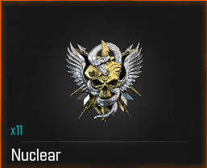

# Call of Duty: AFK Bot

Extremely Effective at Lowering Skill Based Matchmaking and Gaining XP

**Rewritten in C++ for speed, compatibility, and ease of use**
> original build can be found in "originalPythonBuild" branch



## Overview

This AFK Black Ops 6 Bot is a C++ rewrite of my original Python automation bot.

The original version used libraries such as `pynput`, `pyautogui`, and `OpenCV` to simulate keyboard/mouse input and
detect game UI elements. This rewrite moves the core automation logic into C++ using the Windows API for faster input
handling, cleaner structure, and better long-term maintainability.

The bot currently supports:

- Keyboard and mouse automation
- Hotkeys for starting and stopping behavior
- In-game state detection
- Automatic loadout selection
- Terminal-based user interface

---

## Why Rewrite It in C++?

The Python version worked, but it had some limitations:

- Slower input timing
- Heavier dependencies
- Less control over low-level Windows input
- Harder to package cleanly
- More overhead for real-time automation

The C++ rewrite improves the project by using:

- `SendInput` for keyboard and mouse events
- Win32 API calls for lower-level control
- CMake for building
- A cleaner project structure with separated modules

---

## Features

### 1. Hotkey Control

Start and stop the bot without closing the program.

- Start automation [ Left Alt ]
- Stop automation [ Right Alt ]
- Exit safely [ Right Ctrl ]

---

### 2. Mouse and Keyboard Automation

Uses Windows input events to simulate common actions.

Current actions include:

- Mouse clicks
- Mouse movement
- Key presses
- Key holds/releases
- Loadout selection
- Menu navigation

---

### 3. In-Game Detection

Detects whether the game appears to be active using pixel detection.

This allows the bot to make decisions based on screen state without the overhead of reference images.

---

### 4. Auto Loadout Selection

Automatically selects a loadout when a new game begins.

---

### 5. TUI

Includes a simple terminal user interface for controlling the program.

Current TUI features:

- Start menu
- Settings menu
- Status messages

---

### 6. Logging

Logs important events so behavior can be debugged more easily.

Useful for tracking:

- Bot startup
- Hotkey events
- Detection results
- Input errors
- Cleanup behavior

---

## Building

Clone the repo:

```
git clone https://github.com/cw-0/CodBot.git
cd CodBot 
```

Create build folder:

```
mkdir build
cd build
```

Configure and Build:

```
cmake ..
cmake --build .
./CodBot.exe
```

---

## Usage

> [!NOTE]
> Expects Default Mini Map Location and Size
> This has not been tested on a non 1920x1080 display

0. Build & Run (directions above) or Download Release Version
1. In Call of Duty settings set mini map player color to pink:
    - interface > gameplay hud > hud presets > colors > You > [select the bottom right color]

2. Run CodBot.exe and enter `1` to start the bot
3. Search for a match
4. The bot will
    - Select your top loadout
    - play for you indefinitely
    - Search for a new match if it ever gets kicked

> [!IMPORTANT]
> Until Custom Keybinds are added, you can change them manually in Movements.cpp by replacing 0x~~ with the last 2
> places of
> the `Scan 1 Make` column on https://learn.microsoft.com/en-us/windows/win32/inputdev/about-keyboard-input

---

## TODO

- [x] Add Hotkeys For Start/Stop
- [x] Add "In Game" Detection
- [x] Add Auto Select Loadout
- [x] Handle invalid input
- [x] Polish TUI
- [x] Add Logs
- [x] Add kicked from match detection and handling
- [ ] Add Custom keybinds
- [ ] Add setting for preferred Loadout Slot to choose
- [ ] Add settings
- [ ] Add More Randomness
- [ ] Add GUI
- [ ] Improve Clean Up At Exit
- [ ] Improve Killcam Detection
